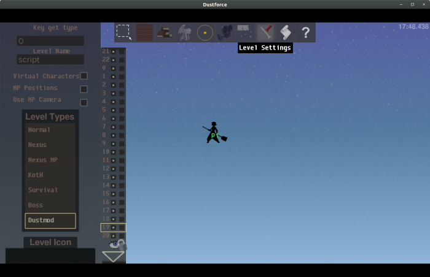
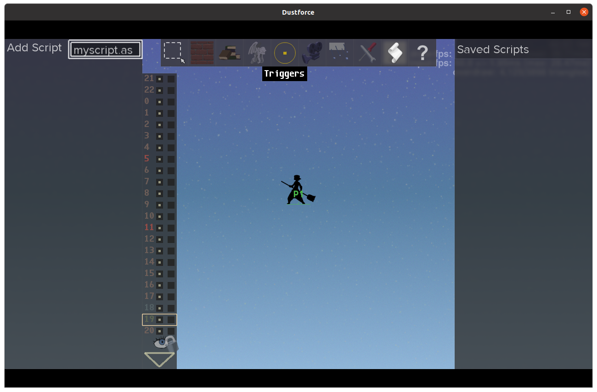
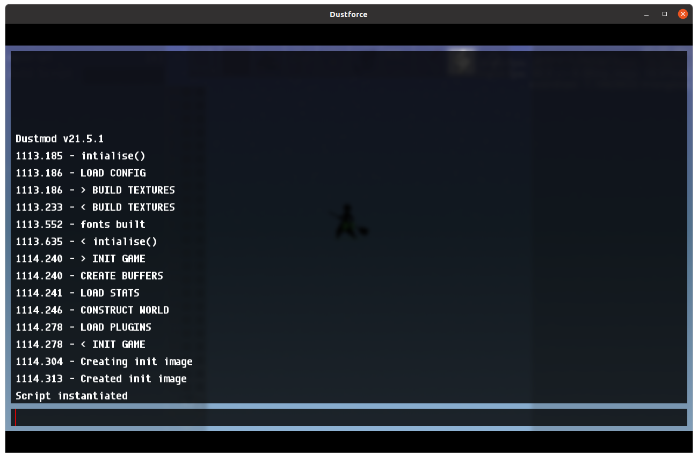

.. https://dustkidblog.wordpress.com/2017/07/27/dustscripting-is-live/

Introduction
============

Dustscripting an extension of Dustmod_ that allows mapmakers and creators
the ability to add scripted components to maps and extend the behavior of
Dustforce in new ways. Scripts are typically used in one of the following
ways:

- Attached to a vanilla level to add visual features for Dustmod_ users.
- Attached to a *dustmod* level to augment the game play of that level.
- As a `plugin <https://dustkid.com/plugins>`_ to augment the game play of all levels with its own
  leaderboard.
- As an *editor plugin*, to augment behavior of the level editor itself.

Dustscript makes use of the AngelScript_ (version 2.31.2) scripting engine
which is the same engine that Dustforce uses for its own internal game logic.
Each script is run within its own isolated context defining one or more
:doc:`script definitions <script>` that communicate back with the game using
the :doc:`Dustmod API <dustapi>`.

Resources
---------

The best way to get help will typically be to join the
`Dustforce discord <https://discord.gg/4F9WQeV>`_ and ask questions in #codeforce.

You may also find the below examples and libraries useful as resources:

- C has a collection of scripts at https://github.com/cmann1/DustScripts
  including `AdvTools <https://github.com/cmann1/DustScripts/blob/master/ed/adv_tools/main.cpp>`_.
- SkyHawk's collection of scripts at https://github.com/Skyhawk33/DustScripts
  including `layer controller <https://github.com/Skyhawk33/DustScripts/blob/main/shared/layer_controller/layer_controller.cpp>`_
- Alex's collection of scripts at https://github.com/AlexMorson/dustforce-scripts.
- `Nexus controller
  <https://github.com/msg555/dustforce_randomizer_nexus/blob/main/script/nexus_controller.cpp>`_
  script that allows you to control key rewards and
  enables nexus randomizer functionality

Examples
^^^^^^^^

- `Fixed camera <https://github.com/Skyhawk33/DustScripts/blob/main/shared/fixed_camera.cpp>`_
  script on `Moniker <https://atlas.dustforce.com/9589/moniker>`_ keeps the camera
  completely steady for a single screen level.
- `Man-girl lock <https://github.com/Skyhawk33/DustScripts/blob/main/map/cirrus/man_girl_lock.cpp>`_
  script on `Cirrus <https://atlas.dustforce.com/9051/cirrus>`_ require the
  player to use either dustman or dustgirl.
- `Down <https://github.com/Skyhawk33/DustScripts/blob/main/map/one_direction/down.cpp>`_
  script on `Down Hill <https://atlas.dustforce.com/10782/down-hill>`_ disables
  all direction inputs except for down.

AngelScript
-----------

Your scripts will need to be written in AngelScript (version 2.31.2) so a
basic understanding of the language will be helpful in writing your own
scripts. Fortunately, AngelScript borrows a lot of syntax from other
languages (in particular C++) so should look fairly familiar to existing
programmers. To better support checkpointing/netplay use of non-const
globals have been disabled (use instance variables in :ref:`class-script` instead).

You can find the AngelScript documentation
`here <http://www.angelcode.com/angelscript/sdk/docs/manual/index.html>`_. The
:doc:`Dustmod API <dustapi>` makes heavy use of object handles in particular
so make sure to review AngelScript's
`object handle <http://www.angelcode.com/angelscript/sdk/docs/manual/doc_script_handle.html>`_
documentation. The engine is configured with the following add-ons:

- `String object
  <https://www.angelcode.com/angelscript/sdk/docs/manual/doc_addon_std_string.html>`_
- `Array template object
  <https://www.angelcode.com/angelscript/sdk/docs/manual/doc_addon_array.html>`_
- `Dictonary object
  <https://www.angelcode.com/angelscript/sdk/docs/manual/doc_addon_dict.html>`_
- `Math functions
  <https://www.angelcode.com/angelscript/sdk/docs/manual/doc_addon_math.html>`_

Security
--------

Scripts are run in a limited environment to reduce the risk of malicious code
being attached to a level. For this reason scripts will never be able to access
external resources and should only have access to the resources explicitly
allotted to them through the :doc:`Dustmod API <dustapi>`.

Nonetheless, if you wish to avoid the risk of running scripts in your Dustmod_
client you can disable scripts by selecting *Overlay -> Disable Scripts* in the
Dustmod menu. As a side effect of this your replays on *dustmod* levels that
contain scripts will no longer validate.

Backwards Compatability
-----------------------

We will avoid updating the API interface in a way that will make existing
scripts stop working in the future. For this reason, methods in the API will
never be deleted however many things may be marked as deprecated or simply not
documented. Occasionally there will be semantic changes to methods to fix bugs.
This typically will only happen to fix obvious bugs but could have the affect of
changing the behavior of existing scripts.

Writing Your First Script
=========================

In this section we'll walk through all the steps to create a new script
that will award the player with an air charge whenevere they clear dust.
To start off we'll open the Dustforce level
editor and set the *Level Type* to *Dustmod* in the *Level Settings* tab.
This will require that our script is running for replays to validate
(if we leave the *Level Type* as *Normal* then the script should be visual
only).

Next let's write a script to attach to the level. Dustmod will look for your
script in one of three places in the following order:

- %DUSTFORCE_USER%/script_src (you will need to create this folder)
- %DUSTFORCE_USER%/level_src
- %DUSTFORCE%

For Steam installations, *%DUSTFORCE_USER%* is located at
*%STEAMAPPS%/common/Dustforce/user*. For drmfree installations this is
at *%APPDATA%/Dustforce/user* on windows and *~/.HitboxTeam/Dustforce/user*
on linux. Let's open up *%DUSTFORCE_USER%/script_src/myscript.as* in
your favorite editor (you may opt to use a "cpp" extension to take advantage
of your editor's C++ syntax highlighting, also).

Writing the script
------------------

Every script needs to define a :ref:`script <class-script>` object. This object
will be created when the script is loaded and can define multiple callbacks that
the engine will use to allow the script to take actions. In our case we're
just interested in using the :ref:`step <method-script-step>` callback.
Let's start by defining our script object with this defined.

.. code-block:: c++

  class script {
    script() {
      // script must have a constructor that takes no arguments.
      puts("Script instantiated");
    }

    void step(int entities) {
      // Called each logic frame
    }
  }

Next let's attach it to our level by clicking on the *script* tab and entering
the name of our script in the *Add Script* textbox.

if it succeeds we should see the script listed as a script with an X button to
remove it. If it fails an error should be written to the console to help
determine the issue. In either case let's open up the console by pressing 
F12 to verify that "Script instantiated" was printed as the script was created.
You can press F12 again to close the console.

Implementing Step Function
--------------------------

To implement our functionality of restoring an air charge when the player
collects dust we'll add a member variable *dust_last* that will be used to
track how much dust the player collected on the last frame. In each frame
we'll check how much dust they've collected and reward them with an aircharge
if its increased while updating our internal counter.

.. code-block:: c++
  :force:

  array<int> dust_last;

  void step(int entities) {
    uint cams = num_cameras();
    for (uint i = 0; i < cams; i++) {
      dustman@ dm = controller_controllable(i).as_dustman();
      if (@dm == null) continue; // non-dustman based controllable

      // Grow tracking array for current player count
      if (i >= dust_last.size()) dust_last.resize(i + 1);

      int dust_cur = dm.total_filth();
      if (dust_cur > dust_last[i]) {
        dm.dash(dm.dash_max()); // Set current air charge counter to max air charges
        dust_last[i] = dust_cur; // Update internal dust counter
      }
    }
  }

Now we can recompile the script and it should be working. To recompile a script
you can Ctrl+Click on the X next to the script or press F9 to recompile all
scripts attached to the level. You can also trigger compilation from the console
(try typing "help compile"). Once you recompile the script you can add some
platforms and dust to verify that the behavior works as intended.

Common Mistakes
---------------

- Do not call draw functions outside of *draw* callback methods. This just
  won't work.
- Do not update any state within *draw* callback methods. *draw* methods can be
  called faster (or even slower) than once per logic frame (which is always 60
  FPS). In multiplayer execution *step* may be called for a long time before
  *draw* is ever called.
- Ensure your script works is deterministic. For example do not use the value
  from :ref:`timstamp_now() <func-timestamp_now>`. This ensures that your script
  will work with both replays and multiplayer.
- Obviously, to make your script work with multiple players make sure to write it
  in a way that does not assume a single player.

Plugins
-------

Plugins are just like normal scripts that are attached to levels except they are
configured globally and run against every level. Plugins have direct support on
https://dustkid.com which grants each plugin published there its own
leaderboard. Plugins can also use the
:ref:`scene.plugin_score <method-scene-plugin_score>` to add additional ranking
metadata beyond just a simple SS based ranking. You can see a list of published plugins at
https://dustkid.com/plugins.

To create a new plugin write a script as you normally would. It's usually
easiest to work on a plugin first as just a script attached to a level. When
your ready to try out your script as a plugin navigate to *Mods -> Tools* in the
Dustmod menu. Enter the source file name of your plugin like you would when
compiling your script in a level in the text box that says "Source". For "Plugin
Name" enter in a display friendly name for the plugin. Then click compile.

This should save the plugin at %DUSTFORCE%/content/plugins/%PLUGIN NAME%. To
publish the plugin hop on to https://dustkid.com/plugins and click on
"Create New Plugin" and follow the submission instructions.

Special APIs
============

There are some situational APIs that are only available in certain contexts.
Generally these APIs grant access to functionality that either does not make
sense in the context of a normal level script or would be game breaking.

Editor API
----------

The :ref:`editor API <class-editor_api>` gives you access to various editor components to
help you build tools that extend the builtin Dustforce editor. For example
you can determine and modify what objects are selected, what panels are open,
and what layers are visible.

Input API
---------

The :ref:`input API <class-input_api>` is similar to the editor API in that it is only
available when the game is running in editor mode. This class will give you
access to text input as well as direct mouse and text input.

Nexus API
---------

The :ref:`nexus API <class-nexus_api>` is available within a nexus level. This API gives
your script access to what keys are used/available and score information for
each level completed within the nexus.

References
==========

.. toctree::
  :caption: Changelist
  :titlesonly:

  changelist/index

.. toctree::
   :caption: Script Definitions
   :titlesonly:

   script

.. toctree::
   :caption: Dustmod APIs

   dustapi

.. toctree::
   :caption: Enums

   enums

.. _Dustmod: http://www.dustmod.com
.. _AngelScript: https://www.angelcode.com/angelscript/sdk/docs/manual/index.html
.. _Plugins: https://dustkid.com/plugins
